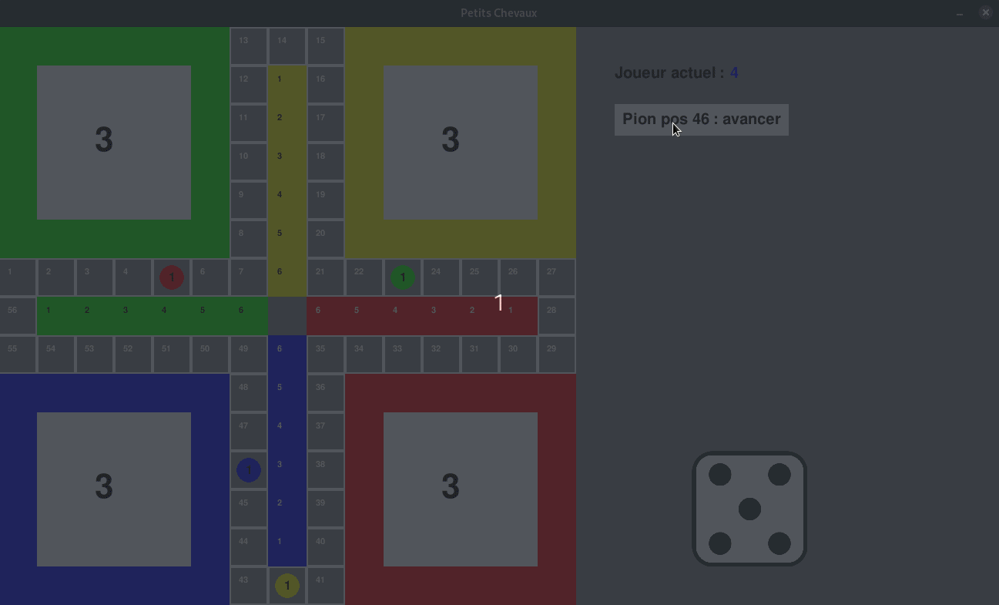

## Développement d’agents autonomes et création de nouvelles règles pour jeux de plateau via l’apprentissage par renforcement

Projet realisé dans le cadre de l'UE "Projet Master" en Master 2 Sciences des Données et Systèmes Complexes par:
- KRUZIC Charlotte
- MARQUIS Zoé
- KUDRIASHOV Daniil
- ZAITCEVA Ekaterina

## Description du Projet 🎮🤖

Ce projet explore l'apprentissage par renforcement appliqué à des jeux de plateau, avec un focus sur le célèbre jeu de société Ludo (également connu sous le nom de "Petits Chevaux"). Initialement, nous avions expérimenté avec le jeu Labyrinthe, mais ce choix a été abandonné en raison de contraintes spécifiques, comme expliqué dans la documentation.

Nous avons conçu plusieurs agents et défini différentes variations de règles, afin d'étudier leurs interactions et performances dans divers contextes de jeu.

## Fonctionnalités principales :
🧠 Création d'agents : Plusieurs agents ont été développés, utilisant notamment l'algorithme Proximal Policy Optimization (PPO) pour optimiser leurs stratégies.  
⚙️ Entraînement des agents : Les agents ont été entraînés sur des environnements simulés, avec des règles variées pour modéliser différents scénarios de jeu.  
🎲 Simulation de parties : Nous avons simulé des affrontements entre agents pour analyser leurs performances dans différents contextes, tout en testant les impacts des variations de règles.  
📊 Analyse des performances : Une analyse approfondie des résultats a été réalisée à l'aide de techniques statistiques et des outils dédiés.  

## Règles du Jeu et Variations 📝🎲

### Règles de Base :

- Chaque joueur commence avec tous ses pions dans une écurie.
- Un 6 au dé est requis pour sortir un pion de l'écurie.
- Une fois sur le plateau, les pions doivent avancer sur un chemin commun de 56 cases, où :
    - Les pions peuvent se croiser ou se faire tuer en arrivant exactement sur une case occupée par un pion adverse.
    - Règles pour les déplacements :
        - Un pion peut tuer un pion adverse uniquement en tombant exactement sur sa case.
        - Bloquage derrière un pion : Si la valeur du dé est strictement supérieure au nombre de cases jusqu’au pion suivant, le joueur est bloqué.
            - Si le pion bloquant appartient au même joueur, on peut :
                - Rejoindre ce pion si la valeur du dé est égale à la distance.
                - S'arrêter sur la case du pion si la valeur du dé est supérieure. : TODO vérifier
- Chaque joueur possède un escalier unique de 6 cases menant à une case objectif.
- TODO : ajouter explications du rester coincé derriere

- **Disposition des écuries selon le nombre de joueurs** :
    - **2 joueurs** : Les écuries sont placées à l'opposé l'une de l'autre sur le plateau. Ainsi, la case 1 du chemin pour un joueur correspond à la case 29 pour l'autre.
    - **3 ou 4 joueurs** : Les écuries sont réparties de manière équidistante toutes les 14 cases. Une même case peut être perçue différemment selon le point de vue du joueur :
        Par exemple, la case 1 pour un joueur sera la case 15, case 29 ou case 43 pour les autres joueurs, en fonction de leur position de départ.
        
    Cela garantit une répartition équilibrée des positions de départ sur le plateau.

### Variations des Règles :
- Nombre de joueurs :
    - Le jeu peut être joué à 2, 3 ou 4 joueurs.
- Nombre de pions par joueur :
    - Chaque joueur peut avoir entre 2 et 6 petits chevaux en jeu.
- Conditions de victoire :
    - Victoire rapide : Le premier joueur à atteindre l’objectif avec un seul pion gagne.
    - Victoire complète : Tous les pions d’un joueur doivent atteindre l’objectif pour déclarer sa victoire.
- Règles pour l'escalier :
    - Exactitude nécessaire : Un pion doit atteindre exactement le pied de l'escalier pour pouvoir commencer à le gravir.
    - Progression simplifiée : Si la valeur du dé dépasse le pied de l’escalier, le pion grimpe directement comme si l’escalier faisait partie du chemin.
- Ordre de progression sur l'escalier :
    - Ordre simplifié : Un pion peut monter plusieurs marches de l'escalier en un seul lancé de dé, il suffit qu'il arrive ou dépasse l'objectif pour l'atteindre.
    - Dans le cas de l'exactitude nécessaire pour le pied de l'excalier, on peut utiliser l'ordre simplifié ou alors l'ordre strict : 
        - Chaque marche de l'escalier nécessite un jet spécifique : 1 pour la première marche, 2 pour la deuxième, ... ainsi que 6 pour atteindre l’objectif.
- Dans le cas de l'ordre strict pour progresser dans l'escalier : 
    - Rejouer lors de la montée de chaque marche (oui ou non)

- Rejouer si dé = 6 (oui ou non)

- Pouvoir protéger un pion (oui ou non) : si on a deux pions sur la même case, alors personne ne peut les tuer.

## Différents agents : 

- TODO DANIIL 

## Comment lancer une partie (avec interface graphique) :
Pour jouer avec l'interface graphique, dans le dossier game, lancer le fichier _play.py_ comme ceci:

    python3 play_pygame/play.py


## Technologies utilisées :
🐍 Python : Langage principal pour la gestion du jeu et des agents.  
🛠️ Gymnasium : Environnements personnalisés pour l'apprentissage par renforcement.  
🤖 Stable-Baselines3 : Bibliothèque utilisée pour entraîner les agents sur les environnements Gymnasium.  
🗄️ PostgreSQL : Base de données pour stocker les résultats des simulations et les métriques des agents.  
📊 Pandas et Jupyter Notebook : Analyse et visualisation des performances des agents.  
🎨 Pygame : Interface graphique pour visualiser les parties en temps réel.  
✅ Pytest : Tests unitaires pour garantir la fiabilité du code.  

# packages, excéuter le jeu ... TODOCOMM 
-> requirements
-> venv (?, plus compatible que conda pour permettre les tests prof)

## Conda environment

```bash
conda env create -f environment.yml
conda activate ludo-env
```


## Arborescence du projet

### À la racine 

Voici la structure des principaux dossiers et fichiers de ce projet, avec une description de leur contenu et rôle.

```bash
.
├── README.md
├── docs/
├── db/
├── game/
├── streamlit/
├── ludo_venv/
├── demo.gif
├── minmap_regles.png
├── requirements.txt
├── requirements_venv.txt
```

#### Description des dossiers et fichiers

- `README.md` : Contient la documentation principale du projet, y compris les objectifs, instructions d'installation et exemples d'utilisation.
- `docs/` : Utilisé tout au long du semestre pour centraliser les recherches, notes, explications, choix d'équipe et toute trace écrite utile à communiquer.
Contient également les fichiers de documentation complémentaires, tels que :
    - Des explications techniques sur le projet.
    - Des captures d'écran ou diagrammes pour illustrer les concepts clés.
- `db/` : Stocke les fichiers relatifs à la gestion des données, comme des bases de données ou fichiers de configuration spécifiques au projet. TODO CHARLOTTE JE TE LAISSE COMPLéter comme tu veux 
- `game/`: Ce dossier constitue le cœur du projet et contient :
    - La logique interne du jeu, ainsi que l'environnement Gym attaché pour les simulations et l'apprentissage par renforcement.
    - Les fichiers nécessaires pour lancer le jeu avec une interface graphique.
    - Des notebooks dédiés à l'apprentissage automatique, permettant d'entraîner et d'évaluer des agents.
    - Des tests en pytest pour garantir que la logique du jeu respecte les règles définies.
- `requirements.txt` : Liste principale des bibliothèques Python nécessaires pour exécuter le projet.
- `requirements_venv.txt` : Une version spécifique des dépendances utilisée avec l’environnement virtuel.

### `game/`

```bash
game/
├── __init__.py                    
├── environment.yml                
├── images/                        
├── ludo_env/                    
├── play_pygame/    
├── reinforcement_learning/        
└── tests_pytest/                  
```

- `__init__.py` : Fichier d'initialisation pour le module Python.
- `environment.yml`: Fichier de configuration pour recréer l'environnement conda.
- `images/` : Contient les images utilisées pour l'interface graphique.
-  `ludo_env/`: Ce répertoire contient l’implémentation complète de l’environnement Gym pour le jeu Ludo, incluant :
    - La logique du jeu.
    - La gestion des états et actions.
    - L'intégration avec Gym pour permettre l’entraînement d’agents RL.
- `play_pygame/`: Dossier contenant le code pour jouer au jeu avec une interface graphique développée avec Pygame.
- `reinforcement_learning/` : Inclut les notebooks et scripts relatifs à l'apprentissage par renforcement.
- `tests_pytest/`: Contient les tests unitaires écrits avec pytest pour s'assurer que :
    - Les règles du jeu sont correctement implémentées.
    - Les actions de l’environnement respectent les contraintes définies.
    - Les résultats sont conformes aux attentes pour différents scénarios.

### `game/ludo_env`

```bash
game/                     
└── ludo_env/                    
    ├── __init__.py              
    ├── __pycache__/             
    ├── action.py                
    ├── env.py                   
    ├── game_logic.py            
    ├── renderer.py             
    ├── reward.py                
    └── state.py                 
```

- `__init__.py` : Ce fichier fait de ludo_env un module Python. Il permet d'importer facilement les fichiers du répertoire dans d'autres parties du projet.
- `action.py` : Définit les actions disponibles pour les agents dans le jeu.
- `env.py` : L’environnement Gym au cœur du projet
    -  Le fichier env.py est une composante centrale de notre implémentation. Il constitue une interface standardisée pour :
        - Jouer au jeu Ludo entre humains via une interface graphique ou textuelle.
        - Effectuer des entraînements en apprentissage par renforcement (RL).
        - Simuler des milliers de parties afin de collecter des données statistiques ou évaluer les performances des agents.

    - Fonctions principales de env.py 
        - `reset()`: Initialise une nouvelle partie et met l’environnement dans son état de départ.
    Retourne l’état initial du plateau sous une forme exploitable par l’agent RL ou par des simulations.
        - `step(action)`: Reçoit une action (proposée par un agent ou un humain).
    Exécute cette action, calcule les conséquences (récompense, état suivant, fin de partie, etc.) et retourne :
            - Le nouvel état.
            - Une récompense associée à l’action.
            - Un indicateur booléen précisant si la partie est terminée.
            - Des informations supplémentaires utiles pour le débogage ou l’analyse.
        - `render()`: Affiche l’état actuel du plateau.

    - Modes et fonctionnalités spécifiques
        - Mode Entrainement 
            - Utilisé pour entraîner des agents en apprentissage par renforcement (RL) avec des algorithmes tels que PPO (Proximal Policy Optimization).
            - Interaction continue avec Stable-Baselines3, où env.py agit comme un pont entre l’algorithme et le jeu.

        - Mode Interface
            - Permet de jouer directement via une interface, que ce soit entre humains ou contre des agents.
            - Gestion des actions non autorisées : Si un agent propose une action invalide (par exemple, déplacer un pion qui ne peut pas bouger), une fonction de `reward.py` corrige cette action en la remplaçant par une action autorisée.
            - La correction suit un ordre par défaut, basé sur le type d'agent.

        - Mode Statistiques
            - Conçu pour analyser les performances des agents en simulant des parties complètes.
            - Deux informations clés sont enregistrées pour chaque action :
                - Si l’action initialement proposée est valide.
                - L’action réellement exécutée (après correction, si nécessaire).
            - Cela permet d’évaluer non seulement les performances des agents, mais aussi leur capacité à proposer des actions conformes aux règles.

- `game_logic.py`: Contient l'implémentation des règles du jeu, la logique du jeu. Gère les actions ainsi que leurs conséquences, vérifie quelles actions sont autorisées à un moment donné... Gère les validations des mouvements (déplacement autorisé ou non), les captures de pions, et la détection des conditions de victoire.
- `renderer.py`: Responsable de l'affichage du jeu.
- `reward.py`: Implémente les fonctions de récompense pour guider l’apprentissage des agents.
Les récompenses peuvent être basées sur :
La progression des pions sur le plateau.
La capture d’un pion adverse.
L’atteinte de la zone d’arrivée.
- `state.py`: Définit les états dans lesquels peuvent se trouver les pions.

### `db/``

TODO CHARLOTTE JE TE LAISSE EXPLIQUER CE QUE TU VEUX EXPLIQUER ICI :) 

---

TODO SUPRRIMER CETTE FIN 

notice des TODO :

TODOTEST : ajouter des tests pour vérifier
TODODELETE ? : fichier à vérifier puis supprimer si besoin 
TODOCOMM : commentaires à ajouter 
TODOREGLE : regle à ajouter / faire varier 
il reste des TODO tout court 