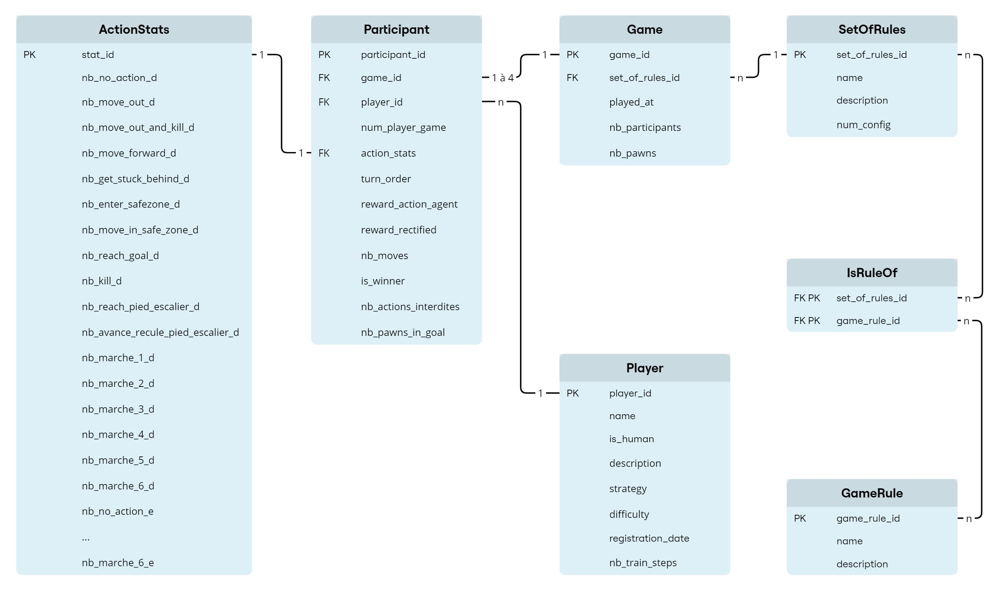

<div align="right">
  <b>English</b> |
  <a href="README.fr.md">Français</a>
</div>

# Autonomous agents development and new rule creation for board games using reinforcement learning
[](https://opensource.org/licenses/MIT)
## Project Description 🎮🤖

This project explores reinforcement learning applied to board games, focusing on the popular board game Ludo (also known as "Petits chevaux" in French). Initially, we experimented with the Labyrinth game, but this choice was abandoned due to specific constraints, as explained in the documentation.

---

### Reformulated subject description and project objectives

This project aims to develop different autonomous agents for board games using reinforcement learning techniques. The main objective is twofold: on one hand, to train these agents to adopt optimal strategies adapted to the game rules, and on the other hand, to study the interactions between different rules and different types of agents to analyze their influence on gameplay and overall game balance.

1. Game modeling
    - Formally represent the game with its states, actions, and observation spaces.
    - Integrate from the start the possibility of adding future rules or variants by designing a flexible architecture.

2. Reinforcement Learning
    - Use RL techniques to train autonomous agents capable of playing the chosen game effectively.
    
3. Agent behaviors and customization
    - Develop different types of agents, each with distinct strategies.
    - Study their behaviors in response to the rule variants being tested.
    
4. Addition of new rules and variants
    - Analyze how these variants influence agent behaviors.
    - Test the impact of different rules on gameplay and game balance.
    
5. Statistical analysis of simulated games
    - Collect detailed statistics on games played by the agents to evaluate their performance.
    - Define criteria to compare rules or variants to determine what improves gameplay.

## Main Features:
🧠 **Agent creation:** Several agents have been developed, notably using the Proximal Policy Optimization (PPO) algorithm to optimize their strategies.  
⚙️ **Agent training:** The agents were trained in simulated environments, with varied rules to model different game scenarios.  
🎲 **Game simulation:** We simulated confrontations between agents to analyze their performance in different contexts, while testing the impacts of rule variations.  
📊 **Performance analysis:** An in-depth analysis of the results was conducted using statistical techniques and dedicated tools.  
🎮 **Interactive graphical interface:** The developed graphical interface allows human users to challenge agents directly or simulate games between humans.

---

## Game rules and variations 📝🎲

### Basic rules:

- Each player starts with all their pawns in their stable.
- A roll of 6 on the die is required to move a pawn out of the stable.
- Once on the board, pawns advance on a common path of 56 spaces leading to a 6-space staircase, specific to each player, that ends at a target space.
- Rules for movement on the common path:
    - Killing an opponent's pawn: A pawn can eliminate an opponent's pawn only if it lands exactly on the same space.
    - Joining an allied pawn: A player's pawn can join another pawn of the same player only if the die roll result exactly matches the distance between them.
    - Being blocked behind a pawn: If the die value is greater than the number of spaces to the next pawn on the board (whether it belongs to the same player or an opponent), the pawn will advance to the space preceding the obstacle. Passing pawns is prohibited. These rules do not apply to the staircase.
- **Stable arrangement according to the number of players**:
    - **2 players**: The stables are placed opposite each other on the board. Thus, space 1 of the path for one player corresponds to space 29 for the other.
    - **3 or 4 players**: The stables are evenly distributed every 14 spaces. The same space can be perceived differently depending on the player's perspective:
        For example, space 1 for one player will be space 15, space 29, or space 43 for other players, depending on their starting position.
        
    This ensures a balanced distribution of starting positions on the board.

### Rule variations:
- Number of players:
    - The game can be played with 2, 3, or 4 players.
- Number of pawns per player:
    - Each player can have between 2 and 6 pawns in play.
- Victory conditions:
    - Quick victory: The first player to reach the goal with a single pawn wins.
    - Complete victory: All of a player's pawns must reach the goal to declare victory.
- Rules for reaching the base of the staircase:
    - Exactness required: A pawn must reach exactly the space at the base of the staircase to begin climbing it.
        - If the die roll exceeds the distance required to reach this space, the pawn can move forward and then backward, provided this movement reduces the distance between it and the space at the base of the staircase.
        - If, by moving forward and then backward according to the die value, the pawn ends up moving further away from the space at the base of the staircase, then it cannot be moved.
    - Simplified progression: If the die value exceeds the base of the staircase, the pawn climbs directly as if the staircase were part of the path.
- Order of progression on the staircase:
    - Simplified order: A pawn advances the distance indicated by the die. This allows it to climb multiple steps of the staircase in a single roll, and to reach the target space directly if the die value allows or exceeds it.
    - Strict order (allowed only if exactness is required to reach the base of the staircase):
        - Each step of the staircase requires a specific roll: 1 for the first step, 2 for the second, ..., and 6 to reach the target space.
        - An optional rule can be added to allow or not allow the pawn to play again after each step climbed.
- Roll again after rolling a 6: This rule can be activated or deactivated.
- Pawn protection: If two pawns of the same player are on the same space, they become invulnerable and cannot be eliminated. This rule can be activated or deactivated.

## Different agents:

In our project, we developed six distinct types of agents, each with its own strategy and reward system:

- **Balanced Agent**: Agent using a balanced strategy between attack and progression, serving as a reference for comparing other agents.

- **Aggressive Agent**: Agent prioritizing offensive actions with maximum rewards for eliminating opponent's pawns.

- **Rusher Agent**: Agent focused on rapid progression towards the goal with a reward system favoring forward movements and goal achievement.

- **Defensive Agent**: Agent prioritizing pawn safety with significant rewards for reaching safe zones and mutual pawn protection.

- **Spawner Agent**: Agent focused on rapid pawn deployment from the stable with maximum rewards for deployment actions.

- **Suboptimal Agent**: Agent simulating an inexperienced player with higher rewards for generally less effective actions.

Each agent has its own reward table, adapted to its strategy. This diversity allows exploring different game approaches and studying their relative effectiveness in different rule configurations.

### Mindmap summarizing different configurations


---

## Technologies used:
🐍 Python: Main language for game management and agents.  
🛠️ Gymnasium: Custom environments for reinforcement learning.  
🤖 Stable-Baselines3: Library used to train agents on Gymnasium environments.  
🗄️ PostgreSQL: Database to store simulation results and agent metrics.  
📊 Pandas and Jupyter Notebook: Analysis and visualization of agent performance.  
🎨 Pygame: Graphical interface to visualize games in real-time.  
✅ Pytest: Unit tests to ensure code reliability.  

--- 

## Installation

### Python version
We used **Python 3.11** for this project.
Make sure this version is installed on your machine:

#### Installing Python 3.11
- MacOS (via Homebrew):
```bash
brew install python@3.11
```

- Linux (Ubuntu):
```bash
sudo apt update
sudo apt install python3.11
```

#### Verifying the installation:
```bash
python3.11 --version
```

### Creating the virtual environment
To ensure compatibility and facilitate testing, we used `venv`.

#### Check availability of `venv`
```bash
python3.11 -m venv --help
```
- If this command works, you can continue.
- Otherwise, install `venv`:
    - On MacOS, when Python 3.11 is installed via Homebrew, the `venv` module is included by default. If the previous command generated an error:
    ```bash
    brew update
    brew upgrade python
    brew reinstall python@3.11
    ```

    - Linux (Ubuntu)
    ```bash
    sudo apt update
    sudo apt install python3.11-venv
    ```

#### Steps to create and configure the virtual environment
- Create the virtual environment
From the project root:
```bash
python3.11 -m venv ludo_venv
```

- Activate the virtual environment
    ```bash
    source ludo_venv/bin/activate
    ```

- Update `pip` in the virtual environment
```bash
pip install --upgrade pip
```

- Install dependencies
```bash
pip install -r requirements_venv.txt
```

#### Deactivate the virtual environment
Once you have finished your tests or no longer need to use the virtual environment, you can easily deactivate it. This will allow you to return to your global or system Python environment.

To deactivate the virtual environment, simply run the following command:
```bash
deactivate
```

This deactivates the active virtual environment without deleting its files. You can reactivate it later if needed.

### Using the virtual environment in notebooks

For analyses, experiments, and training, we used Jupyter notebooks via VSCode. If you want to run a notebook as part of this project, we recommend using VSCode, as we haven't tested this configuration with other tools or editors.

The `ipykernel` package, necessary to connect the virtual environment to Jupyter notebooks, is already included in the dependencies listed in the `requirements_venv.txt` file.

#### Steps to configure the kernel in VSCode:

- Open a `.ipynb` notebook in VSCode
- Click on **Run All** or the **Select Kernel** option located in the top right of the interface.
- In the menu that appears, click on **Select Another Kernel...**
- In the **Python Environments** section, choose the corresponding virtual environment (`ludo_venv`)

Once these steps are completed, the notebook will be configured to use the virtual environment, and you can run your analyses with full compatibility with the project dependencies.

### Steps to configure the database

Please refer to the following file for complete instructions on setting up PostgreSQL, creating the ludo_stats database, and initializing its structure: `./db/Windows_db_configuration_and_setup.md` and `./db/Ubuntu_db_configuration_and_setup.md`

These instructions are specifically adapted for Windows and Ubuntu. If you're using another operating system, they may not work. In this case, please search online for how to install PostgreSQL for your environment.

Note that **installing PostgreSQL is not mandatory**, unless you want to record new data. The data necessary for our analyses has already been exported to CSV files and can be found in the `db/data` folder.

---

## Starting a game with graphical interface
To play with the graphical interface, go to the `game` directory

```bash
cd game
```

Then run the `play.py` file like this:

```bash
python3 play_pygame/play.py
```

Here is an excerpt from a game showing a human player and three agents in action.


#### Untrained Agents
After configuring the game rules according to your preferences, it is possible that the agent corresponding to this configuration has not yet been trained. If an untrained agent is used, the program will fail.
In this case, you need to restart the program and choose a different rule configuration.

**Expected Error Message**

Here is an example of an error message that may appear in this case:
```bash
"The file <model_file_name> does not exist. Please train the agent before using it."
```
---

## Tests with Pytest

To ensure that the game logic is robust and works as expected, we have implemented unit tests with Pytest. These tests cover different aspects of the game logic to ensure that each feature is correctly implemented.

#### Running Pytest tests
To run the tests, use the following command at the project root:
```bash
pytest game/tests_pytest/
```

#### Expected result
If all tests pass successfully, you should see output similar to this:

```bash
============================== 81 passed, 1 warning in 1.30s ==============================
```

This indicates that 81 tests have been successfully validated. The warning may be due to a dependency or configuration and should not affect the main functionality of the game.

---

## Results and analyses

### Database and game simulations

#### Database

The project relies on a PostgreSQL relational database to collect, structure, and analyze data generated during game simulations. This database centralizes relevant information about players, games, rules, and actions taken.



#### Game simulations

Game simulations are executed automatically using the `ludo_stats_play.py` file from the `./db` folder. This script is designed to launch a large number of games between agents, with the main objective of recording data generated during each game. The collected statistics, such as agent performances, their actions, scores, and game results, are automatically saved in the database. This information is then used for analyzing agent performance and behavior.

The data generated during simulations is recorded in the database, then exported in CSV format to facilitate analysis in Python notebooks. These files form the basis of detailed analyses, allowing visualization of key metrics such as scores obtained, error rates, or the distribution of types of actions performed by agents. These analyses aim to demonstrate the effectiveness of agent training, their performance, but also to identify areas for improvement in their behaviors and strategies.

### Analysis of agent training

Note: The complete analysis of the training is available in the notebook `db/analyse/analyse_entrainement.ipynb`.

#### Objective

Study the training of RL agents by analyzing the evolution of their performance as a function of the number of training steps, across game configurations of increasing complexity.

#### Data and analysis parameters
**Data**

The data used for this analysis were collected from massive simulations of games between identical agents, i.e. of the same type and with the same number of training steps, launched with the `main_lancer_parties_pour_analyse_entrainement()` function from the `ludo_stats_play.py` file.

**Metrics**

- Distribution of types of actions requested
- Average percentage of errors
- Average agent score

**Configurations**

- Configuration 16: Basic rules without constraints
- Configuration 12: Intermediate rules with constraints
- Configuration 17: Complete rules with advanced interactions

**Number and types of agents**

All agent types were studied (Balanced, Aggressive, Rusher, Defensive, Spawner, and Suboptimal) in games with: 2 players and 2 pawns, 2 players and 4 pawns, and 4 players and 4 pawns. We trained, played with, and analyzed the performance of these agents with the following numbers of training steps: 50 000, 100 000, 200 000, and 400 000.

#### Results

The results showed that generally, agent training allows progressive learning of new actions, confirming that the training process works. Agents learn to adapt to their environment and master the associated rules.

For **configuration 16**, the simplest, agents show clear and stable performance. The average percentage of errors decreases, and scores increase during training, indicating a good ability to adapt to the environment. However, increasing the number of players and pawns causes a slowdown in training.

Example for the aggressive agent:


With the introduction of additional rules, agent performance becomes less stable. Although some agents continue to progress, others show fluctuations in their error rates and scores.

For **configuration 12**, training remains effective but is less conclusive than for configuration 16. Agents learn certain actions adapted to the new rules, but their adaptability is less marked, and overall performance remains limited.

Example of the aggressive agent:


- Actions at 50 000 steps: NO_ACTION
- New actions at 100 000: MOVE_FORWARD, MARCHE_2
- New actions at 200 000: KILL
- New actions at 400 000: AVANCE_RECULE_PIED_ESCALIER

Example of the difference between aggressive and balanced agents:


Finally, in **configuration 17**, the most complex, agents encounter the greatest difficulties. The average percentage of errors remains high, and average scores remain very low, showing an inability of agents to learn the game rules. Additionally, learning new actions is slower.

Example of the aggressive agent:


- Actions at 50 000 steps: NO_ACTION
- New actions at 100 000: MOVE_FORWARD
- New actions at 200 000: MARCHE_6
- New actions at 400 000: MOVE_OUT

These results show that agents train well for simple rule configurations but also highlight the limitations of RL agents to adapt to increasingly complex environments.

### Analysis of agent performance

The complete analysis of agent performance is available in the notebook `db/analyse/analyse_agents.ipynb`. Here we present a summary of the main results.

Studying agent performance in our game represents a significant analytical challenge due to the considerable number of possible configurations: 32 different rule configurations, games with 2 or 4 players, 6 types of agents, and possibilities of 2 or 4 pawns per player. We therefore focused on the most representative configurations to illustrate our analyses.

#### Performance of agents within a fixed configuration

For configuration 8, which offers an interesting balance between different strategies, we analyzed the relative performance of agents.


*Figure 1: Matrix of win rates between agents (configuration 8)*

This matrix reveals significant differences in strategy effectiveness. For example, the aggressive agent shows strong dominance against the defensive agent (62% wins) but struggles more against the rusher agent (49% wins).

In four-player games, the dynamic changes significantly:


*Figure 2: Distribution of final positions by agent type in 4-player games*

Against multiple opponents, performance gaps narrow. The defensive agent reaches first place as often as the aggressive agent but shows lesser performance for second places.

#### Agent satisfaction according to rules

Agent satisfaction was evaluated according to metrics specific to each strategy. For the aggressive agent, for example:


*Figure 3: Average number of eliminations per game according to configurations*

Configurations 11 and 12, with their stricter constraints on progression towards the goal, allow more eliminations and therefore better satisfaction for the aggressive agent. However, this high satisfaction rate does not always correspond to a better win rate.

#### Balance and playability

The analysis of configuration 7 reveals interesting aspects about game balance:


*Figure 4: Distribution of game lengths according to agent types*

Game duration remains remarkably stable regardless of agent combination, suggesting good overall balance.

However, analysis of 2v2 games shows another reality:


*Figure 5: Distribution of the number of pawns at the goal per team*

The dispersion of points reveals that some agent combinations are significantly more effective than others at reaching the goal, indicating imbalances in this configuration.

---

## Project structure

### At the root

Here is the structure of the main folders and files of this project, with a description of their content and role.

```bash
.
├── README.md
├── README.fr.md
├── project-presentation-slideshow-fr.pdf
├── project-report-fr.pdf
├── docs/
├── db/
├── game/
├── ludo_venv/
└── requirements_venv.txt
```

#### Description of folders and files

- `README.md`: Contains the main project documentation, including objectives, installation instructions, and usage examples in english.
- `README.fr.md`: Contains the main project documentation, including objectives, installation instructions, and usage examples in french.
- `project-presentation-slideshow-fr.pdf`: Slideshow presentation of the project in french.
- `project-report-fr.pdf`: Full project report written in french.
- `project-assignment-fr.pdf`: Initial project statement in French.
- `docs/`: Used throughout the semester to centralize research, notes, explanations, team choices, and any useful written trace to communicate.
Also contains complementary documentation files, such as:
    - Technical explanations about the project.
    - Screenshots or diagrams to illustrate key concepts.

- `db/`: This folder stores the files necessary for managing and exploiting project data. It contains:
    - Scripts to initialize the database, insert data, and export it in CSV format.
    - Exported data used for analyses.
    - Notebooks to analyze agent performance and training.
    - PostgreSQL database configuration files.
    - Scripts to manage game rules and simulated game configurations.
- `game/`: This folder constitutes the core of the project and contains:
    - The internal game logic, as well as the attached Gym environment for simulations and reinforcement learning.
    - Files necessary to launch the game with a graphical interface.
    - Notebooks dedicated to machine learning, allowing training and evaluation of agents.
    - Pytest tests to ensure that the game logic respects the defined rules.
- `requirements_venv.txt`: A specific version of dependencies used with the virtual environment.

### `game/`

```bash
game/
├── __init__.py                  
├── images/                        
├── ludo_env/                    
├── play_pygame/    
├── reinforcement_learning/        
└── tests_pytest/                  
```

- `__init__.py`: Initialization file for the Python module.
- `images/`: Contains images used for the graphical interface.
- `ludo_env/`: This directory contains the complete implementation of the Gym environment for the Ludo game, including:
    - Game logic.
    - State and action management.
    - Integration with Gym to allow RL agent training.
- `play_pygame/`: Folder containing code to play the game with a graphical interface developed with Pygame.
- `reinforcement_learning/`: Includes notebooks and scripts related to reinforcement learning.
- `tests_pytest/`: Contains unit tests written with pytest to ensure that:
    - Game rules are correctly implemented.
    - Environment actions respect defined constraints.
    - Results conform to expectations for different scenarios.

### `game/ludo_env`

```bash
game/                     
└── ludo_env/                    
    ├── __init__.py              
    ├── action.py                
    ├── env.py                   
    ├── game_logic.py            
    ├── renderer.py             
    ├── reward.py                
    └── state.py                 
```

- `__init__.py`: This file makes ludo_env a Python module. It allows easy importing of files from the directory into other parts of the project.
- `action.py`: Defines the actions available to agents in the game.
- `env.py`: The Gym environment at the heart of the project
    - The env.py file is a central component of our implementation. It constitutes a standardized interface for:
        - Playing the Ludo game between humans via a graphical or textual interface.
        - Performing reinforcement learning (RL) training.
        - Simulating thousands of games to collect statistical data or evaluate agent performance.

    - Main functions of env.py
        - `reset()`: Initializes a new game and sets the environment to its starting state.
    Returns the initial state of the board in a form usable by the RL agent or simulations.
        - `step(action)`: Receives an action (proposed by an agent or human).
    Executes this action, calculates the consequences (reward, next state, end of game, etc.) and returns:
            - The new state.
            - A reward associated with the action.
            - A boolean indicator specifying if the game is over.
            - Additional information useful for debugging or analysis.
        - `render()`: Displays the current state of the board.

    - Modes and specific features
        - Training Mode
            - Used to train agents in reinforcement learning (RL) with algorithms such as PPO (Proximal Policy Optimization).
            - Continuous interaction with Stable-Baselines3, where env.py acts as a bridge between the algorithm and the game.

        - Interface Mode
            - Allows playing directly via an interface, whether between humans or against agents.
            - Management of unauthorized actions: If an agent proposes an invalid action (for example, moving a pawn that cannot move), a function from `reward.py` corrects this action by replacing it with an authorized action.
            - The correction follows a default order, based on the agent type.

        - Statistics Mode
            - Designed to analyze agent performance by simulating complete games.
            - Two key pieces of information are recorded for each action:
                - Whether the initially proposed action is valid.
                - The action actually executed (after correction, if necessary).
            - This allows evaluating not only agent performance but also their ability to propose actions conforming to the rules.

- `game_logic.py`: Contains the implementation of game rules, game logic. Manages actions and their consequences, checks which actions are allowed at a given time... Handles movement validations (authorized movement or not), pawn captures, and detection of victory conditions.
- `renderer.py`: Responsible for displaying the game.
- `reward.py`: Implements reward functions to guide agent learning.
Rewards can be based on:
The progression of pawns on the board.
Capturing an opponent's pawn.
Reaching the arrival zone.
- `state.py`: Defines the states in which pawns can be.

### `db/`

The `db/` folder groups all elements necessary to manage the database associated with the project, scripts to collect, transform, and analyze data, as well as the data used for our analyses.

```bash
db/
├── analyse/
│   ├── analyse_agents.ipynb
│   └── analyse_entraînement.ipynb
├── data/
│   ├── action_stats.csv
│   ├── game.csv
│   ├── game_rule.csv
│   ├── is_rule_of.csv
│   ├── participant.csv
│   ├── player.csv
│   └── set_of_rules.csv
├── secret/                     # Folder to create locally
│   └── config.py
├── config_game.py
├── export.py
├── insert.py
├── ludo_stats_play.py
├── notes_db.md
├── rules.py
├── schema.py
├── Ubuntu_db_configuration_and_setup.md
└── Windows_db_configuration_and_setup.md
```
- `analyse/`: Folder containing agent analysis notebooks
    - `analyse_agents.ipynb`: Notebook analyzing performance of trained agents according to game configurations.
    - `analyse_entraînement.ipynb`: Notebook analyzing agent training
- `data/`: Folder containing csv files of data exported from the database and used for analyses.
- `secret/config.py`: Configuration file containing the connection URL to the PostgreSQL database. This folder needs to be created locally.
- `config_game.py`: File containing functions necessary to generate game configurations for games between agents.
- `export.py`: Script to export data from the database in CSV format.
- `insert.py`: File containing classes to insert data into the database.
- `ludo_stats_play.py`: Scripts used to simulate games between agents and record related data in the database.  
This file contains several main functions that we used according to our needs:
    - `main()`: Allows launching one or more games by defining from the terminal: the number of players, the number of pawns, the rule configuration, the agents to use, and the number of games to launch.
    - `main_auto()`: Allows automatically launching multiple games between identical agents (same type and same number of training steps).  
    You must specify the rule configuration, the number of players, the number of pawns, and the number of games to launch.  
    Launches all games for all defined agents corresponding to the specified number of players, pawns, and configuration.
    - `main_lancer_parties_pour_analyse_entrainement()`: Allows executing games generating the data necessary for analyzing agent training.
    - `main_lancer_auto_mathcups()`: Allows executing games generating the data necessary for analyzing trained agents according to game configurations.
- `Ubuntu_db_configuration_and_setup.md` and `Windows_db_configuration_and_setup.md`: Files providing information to configure and use the *ludo_stats* database.
- `rules.py`: File for managing rules (definition, description, and dynamic determination).
- `schema.py`: Script to initialize the database by creating the necessary tables.

---

All installations and features have been tested on Windows and Ubuntu. On macOS, everything has been verified, except for the installation of PostgreSQL, which is not required to run the game and perform analyses.

## 📑 Full documentation
For complete methodology, pedagogical and technical objectives, implementation choices, results analysis, and detailed discussion, please refer to the comprehensive [project report (in French)](project-report-fr.pdf) included in this repository.

## 👷 Contributors
- MARQUIS Zoé
- KRUZIC Charlotte
- KUDRIASHOV Daniil
- ZAITCEVA Ekaterina
