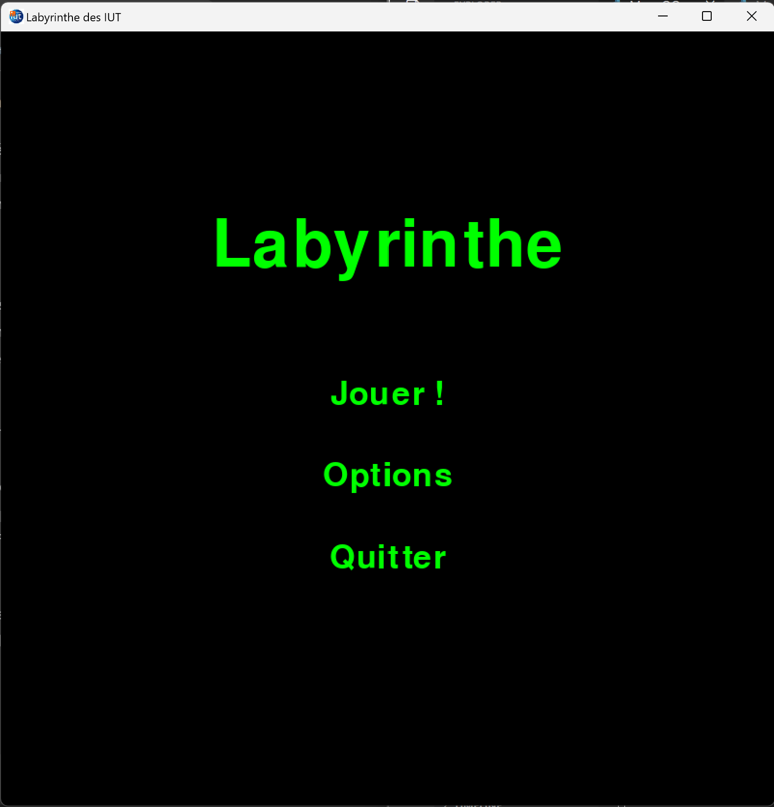

# Revue du “Labyrinthe des IUT”

# 1. Introduction

Le projet “Labyrinthe des IUT” est une version du jeu Labyrinthe développé en Python. Il est disponible ici : [https://github.com/ZeddZull/Labyrinthe-Python](https://github.com/ZeddZull/Labyrinthe-Python).

Dans ce projet, les utilisateurs peuvent naviguer à travers le labyrinthe, récupérer les trésors, mais aussi affronter des intelligences artificielles.

# 2. Objectifs de ce document

Le but de cette revue est de vérifier si les règles du jeu de base ont bien été respectées, que les fonctionnalités développées sont fonctionnelles, et d’avoir une première approche de ce projet pouvant servir de base pour l’entrainement de nos agents RL.

# 3. Interfaces utilisateur

Le jeu se compose de trois écrans principaux : le menu, les options et l'écran de jeu.

## Ecran de Menu

Le menu présente une interface simple qui offre 3 choix au joueur : "Jouer", "Options" ou "Quitter" (cf. Annexe 1). Cet écran permet aux utilisateurs de naviguer facilement et de commencer le jeu en quelques clics.

## Ecran d’Options

Sur l'écran des options (cf. Annexe 2), les utilisateurs peuvent configurer plusieurs paramètres importants pour leur partie :

- Le nombre de joueurs, allant de 1 à 3
- Le nombre d'intelligences artificielles à inclure dans le jeu
- Le nombre total de trésors disponibles, qui peut varier de 12 à 34
- Le nombre de trésors par joueur

Ainsi, cet écran offre la possibilité de personnaliser l'expérience de jeu.

## Ecran de Jeu

L'écran de jeu affiche plusieurs éléments :

- Le plateau de jeu avec les trésors et les joueurs placés
- La prochaine pièce à placer
- Le joueur actuel
- Le nombre de trésors restant à atteindre pour chaque joueur

Ce projet possède également une **version console** (cf. Annexes 4 et 5), en plus de la **version graphique** vu précédemment.

# 4. Respect des règles de jeu

Les règles du jeu de base (cf. Etude du jeu Labyrinthe) sont respectées et complètes. 

# 5. Revue technique

## Langage et bibliothèque

Le projet est développé en **Python** et utilise la bibliothèque **Pygame**. Cette bibliothèque est particulièrement adaptée pour le développement de jeux en 2D, car elle permet notamment de gérer les interactions utilisateurs ainsi que la gestion d’images. 

Les images utilisées pour les pièces, les trésors et les joueurs peuvent être facilement modifiées.

## Intelligences Artificielles (IA)

Le projet inclut également 2 types de joueurs IA, et des fonctions d’évaluations et de recherches.

### Evaluation des déplacements

Le fonction **accessibleDist(ligD, colD, ligA, colA)** permet de vérifier si le joueur peut atteindre la case souhaitée.

### Evaluation de la meilleure position

La fonction **getPositionMinDistance(posCible, posDepart)** permet de rechercher la position la plus proche de la cible en utilisant une méthode de recherche en largeur.

### Types d’IA et actions associées

1. **IA Offensive**

La fonction **getMeilleurAction()** détermine le meilleur coup à jouer pour atteindre le trésor le plus rapidement.

Elle teste différentes positions et orientations de pièces pour voir leurs effets sur l’accès au trésors.

Si le trésor est accessible après un coup, le joueur effectue ce coup. Sinon, il choisit l’action qui réduit le plus la distance au trésor.

1. **IA Défensive**

La fonction **getMeilleurActionDefensive()**  calcule les actions possibles pour bloquer les adversaires et les empêcher d’accéder à leurs trésors.

Elle teste les coups qui pourraient empêcher l’adversaire de trouver le trésor en calculant le nombre de coup gagnants que l’adversaire pourrait effectuer après l’action de défense.

L’objectif est de minimiser les options de l’adversaire tout en maximisant ces propres options (fonction **getCheminDefensif()**).

# Annexes

Annexe 1 : Capture d’écran du menu du jeu

Annexe 2 : Capture d’écran de la fenêtre d’options

Annexe 3 :  Capture d’écran de la fenêtre de jeu

Annexe 4 :  Capture d’écran du choix des options (version console)

Annexe 5 :  Capture d’écran du jeu (version console)